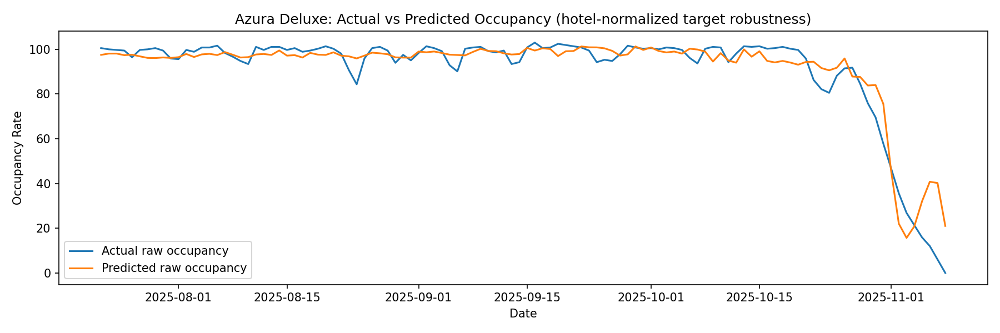
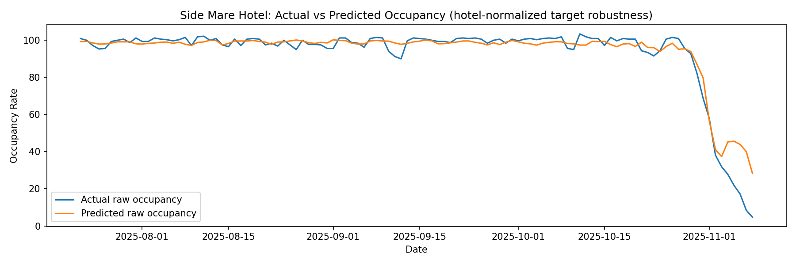
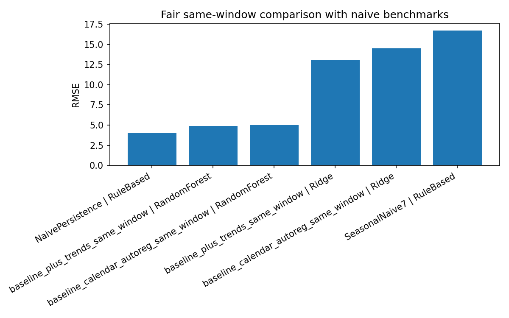

# Final Report: Hotel Occupancy Prediction Using Google Trends

**DSA210 – Introduction to Data Science**  
**Student:** Bedirhan Sar  
**Region:** Antalya / Alanya, Türkiye

---

## 1. Executive Summary

This project investigates whether **Google Trends** can help explain or predict **daily hotel occupancy rates** for resort hotels in the Antalya / Alanya region of Türkiye.

The analysis combines:
- daily occupancy data from **Side Mare Hotel** and **Azura Deluxe**,
- tourism-related Google Trends data from **Germany**, **Netherlands**, **United Kingdom**, and **Türkiye**.

The central idea of the project is that Google Trends should **not** be treated as a direct booking proxy. These hotels operate in a business environment where demand is influenced not only by direct online interest, but also by **tour operators, travel agencies, and other B2B channels**. Therefore, Google Trends is tested as a possible **early travel-intent signal** rather than a direct same-day demand measure.

### Main conclusions

- Occupancy in both hotels is **strongly seasonal**.
- **Same-day Google Trends relationships are weak to moderate**.
- **Lagged Google Trends features are more informative** than same-day values.
- The strongest lagged signal in the EDA was **`trends_turkiye_side_otel` at 28 days**.
- In the learned-model comparisons, **adding lagged Google Trends improved RMSE** in every main evaluation setup.
- However, the best learned models still **did not outperform NaivePersistence**, meaning that daily occupancy forecasting in this dataset remains strongly dominated by short-run persistence.

The final interpretation is therefore balanced: **Google Trends provides useful incremental signal, but not enough to outperform a simple persistence benchmark in the current modeling setup.**

---

## 2. Introduction and Motivation

Hotel occupancy planning is operationally important because staffing, purchasing, and service preparation often need to be decided before guests arrive. In resort hotels, even a rough early signal can be valuable.

This project asks whether online search behavior can provide such a signal. Google Trends is attractive because it captures travel-related public interest, but its usefulness in this setting is uncertain. Antalya / Alanya resort hotels are not driven only by direct online search and direct individual bookings. A meaningful share of occupancy comes from package tourism and agency-driven flows. For that reason, the project does not assume that Trends should strongly explain same-day occupancy. Instead, it tests whether Trends may be useful as an **early supporting indicator**.

The core research question is:

> Can Google Trends act as an early signal for hotel occupancy demand in Antalya-area resort hotels?

---

## 3. Data

### 3.1 Hotel Occupancy Data

Daily occupancy data was collected for two hotels:
- **Side Mare Hotel**
- **Azura Deluxe**

Standardized hotel schema:
- `date`
- `hotel_name`
- `occupancy_rate`

### 3.2 Google Trends Data

Google Trends data was collected for four countries:
- **Germany**
- **Netherlands**
- **United Kingdom**
- **Türkiye**

Standardized Trends schema:
- `date`
- `country`
- `keyword`
- `google_trend`

### 3.3 Final Analytical Table

The final merged master table contains:
- **1307 rows**
- **19 columns**
- **2 hotels**
- date range: **2023-03-25 to 2025-11-08**
- **0 duplicate** `(date, hotel_name)` rows

Each row represents:

> **one hotel on one date**

---

## 4. Research Hypotheses

The project was built around four main hypotheses:

- **H1:** Google Trends has a measurable relationship with occupancy.  
- **H2:** Lagged Google Trends is more useful than same-day Trends.  
- **H3:** Relationship strength depends on country and keyword.  
- **H4:** Occupancy has strong seasonal structure.  

### Hypothesis outcomes

| Hypothesis | Status |
|---|---|
| H1: Google Trends has a measurable relationship with occupancy | **Partially supported** |
| H2: Lagged Trends is more useful than same-day Trends | **Supported** |
| H3: Relationship strength depends on country and keyword | **Supported** |
| H4: Occupancy has strong seasonal structure | **Supported** |

---

## 5. Methodology

The project followed a full data science workflow:

1. Data collection and cleaning  
2. Standardization of hotel and Trends datasets  
3. Exploratory Data Analysis (EDA)  
4. Same-day correlation analysis  
5. Lagged Trends analysis  
6. Feature engineering  
7. Machine learning comparison  
8. Robustness checks  
9. Time-aware validation  
10. Benchmark comparison  

### 5.1 EDA and Lag Analysis

The EDA stage focused on:
- data quality,
- occupancy seasonality,
- same-day Trends relationships,
- lagged Trends relationships,
- and hotel-wise normalization robustness.

Lagged Google Trends features were evaluated at:
- **7 days**
- **14 days**
- **21 days**
- **28 days**

### 5.2 Machine Learning Design

The ML stage compared two learned settings:

#### Baseline learned model
Features included:
- hotel identity,
- calendar variables,
- cyclical seasonality variables,
- occupancy lags.

#### Baseline + lagged Google Trends learned model
This setup added selected lagged Trends features identified in the EDA stage.

### 5.3 Models Used

- **Ridge Regression**
- **Random Forest Regressor**

### 5.4 Validation Stages

The ML evaluation was expanded in several steps:

1. **First-pass temporal holdout**  
2. **Hotel-wise normalization robustness**  
3. **Fair same-window comparison**  
4. **Walk-forward validation**  
5. **Naive benchmark comparison**  

### 5.5 Rule-Based Benchmarks

To make the evaluation more honest, two simple baselines were included:
- **NaivePersistence**: predict today with yesterday’s occupancy
- **SeasonalNaive7**: predict today with the value from 7 days earlier

---

## 6. Exploratory Data Analysis Findings

### 6.1 Strong seasonality in hotel occupancy

The first major finding of the project was that occupancy is strongly seasonal for both hotels.

The figure above shows that occupancy follows a clear seasonal rhythm, which immediately implies that calendar effects and past occupancy should be strong predictors.

A monthly aggregation makes the same pattern even clearer:

This supports **H4** and also explains why simple persistence-style models may be difficult to beat.

---

### 6.2 Same-day Google Trends is limited

The same-day correlation analysis showed that Google Trends is **not** a strong direct explanation of same-day hotel occupancy.

The strongest same-day features were weak to moderate rather than strong. This is consistent with the business context of the hotels: actual occupancy depends on booking pipelines and agency-driven demand that may not be visible in same-day search activity.

This means **H1** is only partially supported when examined on a same-day basis.

---

### 6.3 Lagged Google Trends is more promising

The lag analysis produced one of the most important findings of the project.

Several Trends variables became more informative when shifted backward in time, showing that search behavior is more useful as an **early signal** than as an immediate explanatory variable.

The strongest lagged signal was:
- **`trends_turkiye_side_otel` at 28 days**

This is the clearest support for **H2**.

The lag overlay below provides an intuitive visual illustration of this pattern:

---

### 6.4 Hotel-wise normalization robustness

Because the project pools two different hotels, a robustness check was added to ensure that the pooled findings were not merely caused by cross-hotel level differences.

The target was normalized within each hotel using a hotel-wise z-score.

Same-day robustness comparison:

Lagged robustness comparison:

The key result of this robustness layer is that the main ranking of useful lagged Trends variables remains broadly similar after hotel-level normalization. This strengthens the claim that the EDA findings are not only artifacts of pooling two hotels with different average occupancy levels.

---

## 7. Machine Learning Findings

The ML stage was designed to answer a more focused question:

> Do lagged Google Trends features improve learned-model performance beyond seasonality, hotel identity, and past occupancy?

### 7.1 First-pass learned-model result

The first ML pass used a time-aware holdout split.

| Setting | Best RMSE |
|---|---:|
| Baseline learned model | 5.87 |
| Baseline + Trends learned model | 4.80 |

This shows a substantial RMSE improvement when lagged Google Trends is added.

First-pass prediction plots:

At this stage, the evidence supported the view that Trends adds useful signal inside the learned-model comparison.

---

### 7.2 Hotel-normalized robustness result

A second ML specification used hotel-wise normalized occupancy as the target to test whether the learned-model gain might be driven mainly by hotel-level scale differences.

| Setting | Best RMSE |
|---|---:|
| Baseline learned model (normalized target, back-transformed) | 6.19 |
| Baseline + Trends learned model (normalized target, back-transformed) | 5.67 |

Prediction plots under the robustness specification:

This supports the idea that the Trends contribution is not solely due to raw hotel-level differences.

---

### 7.3 Fair same-window comparison

The first-pass comparison still allowed slight differences in row availability between feature sets. To make the learned-model comparison cleaner, a fair same-window evaluation was added.

| Setting | Best RMSE |
|---|---:|
| Baseline learned model | 4.974 |
| Baseline + Trends learned model | 4.798 |

Fair same-window prediction plots:

This again shows that lagged Google Trends improves learned-model performance, even under a stricter comparison design.

---

### 7.4 Walk-forward validation

A stronger time-series evaluation was added using expanding-window walk-forward validation.

| Setting | Mean RMSE Across Folds |
|---|---:|
| Baseline learned model | 8.166 |
| Baseline + Trends learned model | 8.035 |

Walk-forward visuals:

The improvement from Trends remained **positive**, but smaller and more variable across time. This suggests that the Trends signal is real but modest in the more demanding validation setup.

---

## 8. Explicit Metric Improvement Summary

Because the project aims to evaluate whether Google Trends adds real predictive value, the most important learned-model comparison can be summarized directly.

| Comparison | Best baseline RMSE | Best baseline + Trends RMSE | Improvement from Trends |
|---|---:|---:|---:|
| First-pass holdout | 5.87 | 4.80 | 1.07 |
| Fair same-window | 4.974 | 4.798 | 0.176 |
| Walk-forward mean | 8.166 | 8.035 | 0.131 |

### Interpretation of the table

This table shows the key learned-model finding of the project:

> **Adding lagged Google Trends improved the learned models in every main evaluation setting.**

This is important because it means Google Trends is not irrelevant. It contributes useful incremental information beyond seasonality and past occupancy.

---

## 9. Benchmark Comparison and Final ML Interpretation

The next question is whether the learned models are not only improved by Trends, but actually strong in absolute forecasting terms.

That is why rule-based benchmarks were added.

### 9.1 Same-window benchmark comparison

| Model | RMSE |
|---|---:|
| Best learned model (`baseline_plus_trends / RandomForest`) | 4.798 |
| NaivePersistence | 4.068 |
| SeasonalNaive7 | 7.808 |

### 9.2 Walk-forward benchmark comparison

| Model | Mean RMSE |
|---|---:|
| Best learned model (`baseline_plus_trends / RandomForest`) | 8.035 |
| NaivePersistence | 4.170 |
| SeasonalNaive7 | 8.350 |

Naive benchmark visuals:

### Final ML interpretation

This benchmark stage changes the final meaning of the ML results.

It is true that:
- Google Trends **improved the learned models**, and
- the best learned model was consistently the **Trends-augmented Random Forest**.

However, it is also true that:
- the best learned model still **did not outperform NaivePersistence**.

So the final conclusion cannot simply be “Google Trends gives the best forecasting model.”

The more accurate conclusion is:

> **Lagged Google Trends adds useful signal inside the learned-model framework, but the current forecasting pipeline remains weaker than a simple persistence benchmark.**

This is one of the most important findings of the project because it makes the interpretation honest and practically meaningful.

---

## 10. Discussion

The project shows that Google Trends is neither useless nor dominant.

### What the project supports

- Google Trends is **not a strong same-day proxy** for resort hotel demand.
- Lagged Trends contains useful information as an **early travel-intent signal**.
- Some countries and keywords are clearly more informative than others.
- Trends can improve learned models when combined with seasonality and past occupancy.

### What the project does not support

- It does not support the claim that Google Trends is enough on its own to predict occupancy.
- It does not support the claim that the current learned models outperform simple occupancy persistence.

### Why the benchmark result makes sense

This result is consistent with the structure of hotel occupancy data:
- daily occupancy is highly continuous from one day to the next,
- occupancy is strongly seasonal,
- and search behavior is only one indirect signal among many drivers.

So it is reasonable that Trends improves a learned model, but still does not beat a strong persistence rule.

---

## 11. Limitations

The project has several important limitations:

- Only two hotels are included, so the results should not be generalized to all Antalya hotels.
- Google Trends provides **relative search interest**, not actual booking counts.
- B2B channels such as agencies and tour operators reduce the direct link between search interest and occupancy.
- Some Trends features are sparse or noisy.
- Daily occupancy is highly persistence-dominated, which makes the forecasting task difficult.

These limitations do not invalidate the project, but they explain why the final claim must remain careful.

---

## 12. Future Work

Future extensions that could improve the project include:

- adding more hotels,
- adding one additional external dataset such as flight, holiday, or weather data,
- testing different forecast horizons,
- building hotel-specific models,
- and examining whether Google Trends becomes more useful at horizons where persistence weakens.

---

## 13. Final Conclusion

This project examined whether Google Trends can help explain or predict daily occupancy rates for Antalya / Alanya resort hotels.

The final evidence supports a measured conclusion.

1. **Occupancy is strongly seasonal and persistence-dominated.**  
2. **Same-day Google Trends is weak to moderate.**  
3. **Lagged Google Trends is more useful and provides real incremental signal.**  
4. **This signal improves learned-model RMSE in every main comparison.**  
5. **Nevertheless, the best learned models still do not beat NaivePersistence.**  

Therefore, the most defensible overall conclusion is:

> **Google Trends has real but limited predictive value in this setting. It is best interpreted as an early supporting indicator that complements seasonality and past occupancy, rather than as the main driver of hotel occupancy forecasts.**

This conclusion is consistent with both the statistical findings and the business reality of resort hotels that rely on both direct consumer interest and intermediary-driven demand.

---

## 14. Files Related to This Report

Main notebooks:
- `EDA/EDA_detailed_report.ipynb`
- `ML/ML_detailed_report.ipynb`

Main report figures:
- `EDA/Visualizations/`
- `ML/Figures/`

Main scripts:
- `scripts/modeling_baseline_commented.py`
- `scripts/hotel_normalization_robustness_commented.py`
- `scripts/modeling_fair_comparison_commented.py`
- `scripts/modeling_walk_forward_commented.py`
- `scripts/modeling_naive_benchmarks_commented.py`

