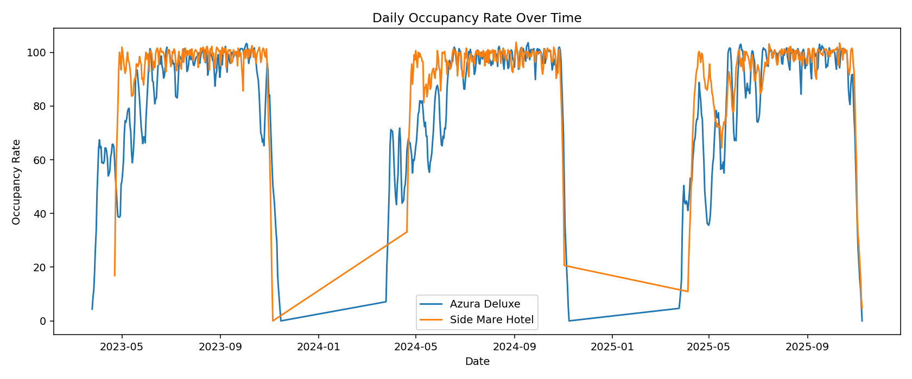
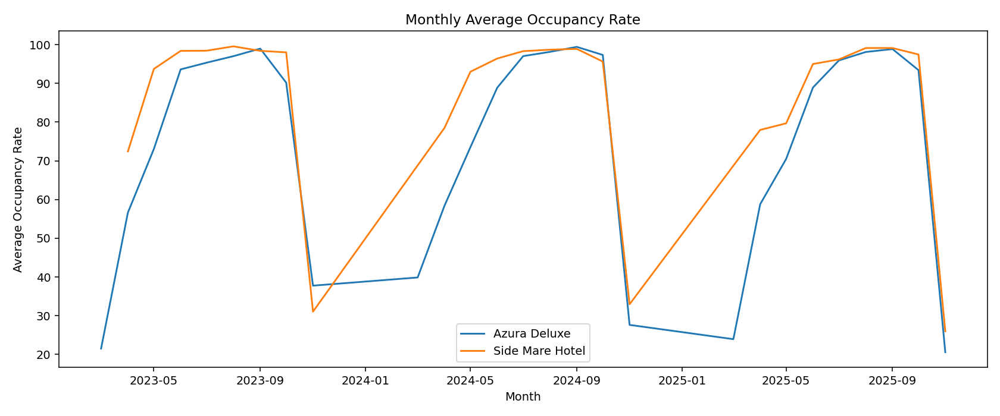
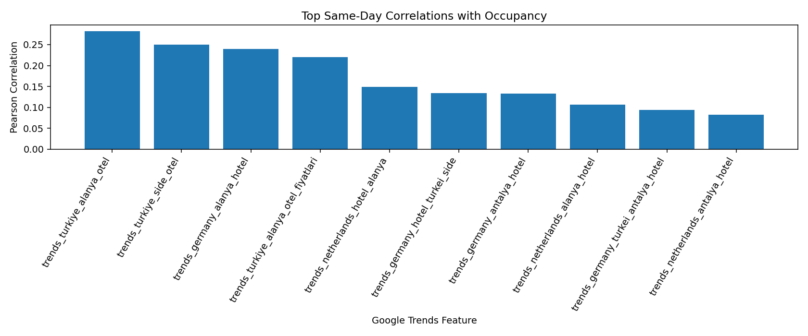
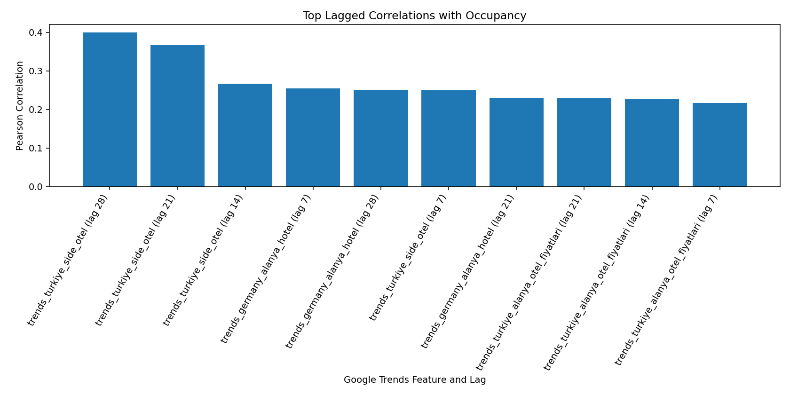
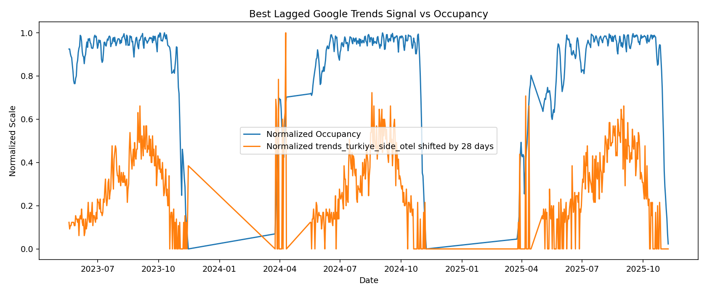
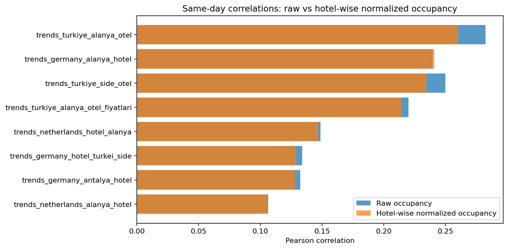

# Hotel Occupancy Prediction with Google Trends

**DSA 210 / Undergraduate Data Science Project**  
**Region:** Antalya / Alanya, Türkiye  
**Student:** Bedirhan Sar

---

## 1. Project Overview

This project investigates whether **Google Trends** can help explain and predict **daily hotel occupancy rates** for resort hotels in the Antalya/Alanya region of Türkiye.

The project combines:
- daily hotel occupancy data from **Side Mare Hotel** and **Azura Deluxe**,
- tourism-related Google Trends data collected from **Germany**, **Netherlands**, **United Kingdom**, and **Türkiye**.

Because these hotels are not driven only by direct B2C demand and also rely heavily on **B2B channels** such as tour operators and travel agencies, Google Trends is not treated as a direct booking proxy. Instead, it is evaluated as a possible **early signal of travel intent**.

### Central Question

> Can Google Trends provide useful incremental information for understanding and forecasting daily resort hotel occupancy in the Antalya/Alanya region?

---

## 2. Why This Project Fits the Course Well

Within the DSA210 framing you uploaded, a strong project should have a **unique dataset**, a **novel idea or hypothesis**, and should combine **exploration, inference, prediction, and communication** rather than just applying software mechanically. fileciteturn132file0L1-L1

This repository fits that structure well because it includes:
- a real-world hotel occupancy dataset,
- a clear hypothesis-driven question about Google Trends,
- detailed EDA and visualization,
- inference through correlation and lag analysis,
- prediction through progressively improved ML evaluation,
- and explicit communication of limitations.

The course material on model evaluation also emphasizes that what matters is performance on **unseen data**, along with proper splitting, avoidance of leakage, and comparison against **baseline models**. fileciteturn132file1L1-L1

This repo reflects that progression through:
- first-pass temporal holdout,
- fair same-window comparison,
- walk-forward validation,
- and naive benchmark comparison.

---

## 3. Main Findings

| Finding | Result |
|---|---|
| Occupancy seasonality | **Strongly present** in both hotels |
| Same-day Google Trends relationships | **Weak to moderate** |
| Lagged Google Trends relationships | **Stronger and more promising** |
| Strongest lagged signal in EDA | `trends_turkiye_side_otel` at **28 days** |
| Country / keyword differences | **Meaningful differences exist**; Türkiye and Germany are often stronger than many UK features |
| First-pass learned ML | **Lagged Google Trends improved learned-model performance**, but seasonality and past occupancy remained dominant |
| Fair same-window learned ML | **Trends still improved learned-model performance** on the same rows and same test period |
| Walk-forward learned ML | **Average improvement remained positive but modest**, with variability across folds |
| Final benchmark check | **NaivePersistence outperformed all learned models** |

### Hypothesis Summary

| Hypothesis | Status |
|---|---|
| H1: Google Trends has a measurable relationship with occupancy | **Partially supported** |
| H2: Lagged Trends is more useful than same-day Trends | **Supported** |
| H3: Relationship strength depends on country and keyword | **Supported** |
| H4: Occupancy has strong seasonal structure | **Supported** |

### Final ML Conclusion

The final ML conclusion is intentionally cautious:

> Lagged Google Trends improves the learned models, but the current ML pipeline does **not** outperform the strongest simple benchmark, **NaivePersistence**.

So the project supports Google Trends as a **supporting external signal**, not as a dominant forecasting driver.

---

## 4. Data

### Hotel Data
- **Side Mare Hotel**
- **Azura Deluxe**
- Daily target variable: `occupancy_rate`

### Google Trends Data
Collected for 4 countries:
- **Germany**
- **Netherlands**
- **United Kingdom**
- **Türkiye**

Standardized trends schema:
- `date`
- `country`
- `keyword`
- `google_trends_score`

### Final Master Table
The merged analytical dataset has:
- **1307 rows**
- **19 columns**
- **2 hotels**
- date range: **2023-03-25 to 2025-11-08**
- **0 duplicate** `(date, hotel_name)` rows

---

## 5. Repository Structure

```text
myDSAproject/
│
├── data/
│   └── master/
│       └── hotel_master_table.xlsx
│
├── EDA/
│   ├── EDA_detailed_report.ipynb
│   └── Visualizations/
│
├── ML/
│   └── ML_detailed_report.ipynb
│
├── scripts/
│   ├── modeling_baseline_commented.py
│   ├── hotel_normalization_robustness_commented.py
│   ├── modeling_fair_comparison_commented.py
│   ├── modeling_walk_forward_commented.py
│   └── modeling_naive_benchmarks_commented.py
│
├── model_outputs/
│   ├── baseline_ml/
│   ├── hotel_normalization_robustness/
│   ├── fair_same_window_comparison/
│   ├── walk_forward_validation/
│   └── naive_benchmark_comparison/
│
├── reports/
│   ├── EDA_Reports/
│   └── ML_reports/
│
└── README.md
```

---

## 6. Exploratory Data Analysis

The EDA phase established the project’s structure before modeling.

Main EDA steps:
- data quality checks,
- occupancy summary by hotel,
- daily and monthly seasonality visualization,
- same-day correlation analysis,
- lagged Google Trends analysis,
- hotel-wise normalization robustness check.

### EDA Report
- Detailed notebook: [EDA/EDA_detailed_report.ipynb](EDA/EDA_detailed_report.ipynb)

### Key EDA Visualizations


*Daily occupancy over time for both hotels, showing strong seasonality and differences in volatility.*


*Monthly average occupancy, making the recurring seasonal pattern easier to interpret.*


*Top same-day Pearson correlations between Google Trends features and occupancy.*


*Top lagged Pearson correlations, showing that delayed search behavior is more informative than same-day search activity.*


*Visual comparison between normalized occupancy and the strongest lagged Google Trends signal.*

### Hotel-wise Normalization Robustness Layer

Because the project pools two hotels with different average occupancy levels, an additional robustness step was added.

This robustness pass asks:
> Do the main pooled findings still hold after normalizing occupancy within each hotel?

Used normalization:

`occupancy_rate_hotel_z = (occupancy_rate - hotel_mean) / hotel_std`

Additional robustness visuals:


*Same-day correlations under raw occupancy vs hotel-wise normalized occupancy.*


*Best lagged correlations under raw occupancy vs hotel-wise normalized occupancy.*

---

## 7. Machine Learning Stage

The ML stage tests whether lagged Google Trends improves prediction beyond:
- hotel identity,
- seasonality,
- and recent occupancy history.

### ML Report
- Detailed notebook: [ML/ML_detailed_report.ipynb](ML/ML_detailed_report.ipynb)

### Learned models used
- **Ridge Regression**
- **Random Forest Regressor**

### Rule-based benchmarks used
- **NaivePersistence**
- **SeasonalNaive7**

### Validation design used across the project
1. **First-pass temporal holdout**  
2. **Hotel-wise normalization robustness**  
3. **Fair same-window comparison**  
4. **Walk-forward validation**  
5. **Naive benchmark comparison**

### Main ML scripts
- [scripts/modeling_baseline_commented.py](scripts/modeling_baseline_commented.py)
- [scripts/hotel_normalization_robustness_commented.py](scripts/hotel_normalization_robustness_commented.py)
- [scripts/modeling_fair_comparison_commented.py](scripts/modeling_fair_comparison_commented.py)
- [scripts/modeling_walk_forward_commented.py](scripts/modeling_walk_forward_commented.py)
- [scripts/modeling_naive_benchmarks_commented.py](scripts/modeling_naive_benchmarks_commented.py)

---

## 8. ML Result Ladder

This repo contains several ML result layers. They should be interpreted in this order:

### 8.1 First-pass learned-model result
- best baseline-only RMSE: **approximately 5.87**
- best baseline + Trends RMSE: **approximately 4.80**

This showed that lagged Google Trends improved the learned models.

### 8.2 Hotel-normalized robustness result
- best baseline-only RMSE after back-transformation: **approximately 6.19**
- best baseline + Trends RMSE after back-transformation: **approximately 5.67**

This suggested that the gain is not only due to cross-hotel level differences.

### 8.3 Fair same-window result
- best baseline-only RMSE: **4.974**
- best baseline + Trends RMSE: **4.798**

This confirmed that the learned-model gain remains when both models are tested on the same rows and same future window.

### 8.4 Walk-forward result
- best baseline-only mean RMSE across folds: **8.166**
- best baseline + Trends mean RMSE across folds: **8.035**

This showed that the gain remains positive on average, but modest and less stable across time.

### 8.5 Final naive benchmark result
- **NaivePersistence RMSE: 4.068** on the fair same-window comparison
- **NaivePersistence mean RMSE: 4.170** in walk-forward validation
- best learned model (`baseline_plus_trends / RandomForest`) remained worse than this benchmark in both settings

This is the final reason why the ML conclusion must remain limited.

---

## 9. Key ML Visualizations

### First-pass learned-model plots


*Actual vs predicted occupancy for Azura Deluxe under the best first-pass trends-augmented learned model.*


*Actual vs predicted occupancy for Side Mare Hotel under the best first-pass trends-augmented learned model.*

### Hotel-normalized robustness plots


*Back-transformed prediction plot for Azura Deluxe under the hotel-normalized robustness specification.*


*Back-transformed prediction plot for Side Mare Hotel under the hotel-normalized robustness specification.*

### Fair same-window plots


*Actual vs predicted occupancy for Azura Deluxe under the fair same-window trends model.*


*Actual vs predicted occupancy for Side Mare Hotel under the fair same-window trends model.*

### Walk-forward visuals


*Fold-by-fold RMSE comparison for baseline and trends-augmented learned models.*


*Average RMSE across walk-forward folds for the learned models.*

### Naive benchmark visuals


*Fair same-window RMSE comparison including rule-based benchmarks.*


*Fold-by-fold RMSE comparison including rule-based benchmarks.*


*Average RMSE across walk-forward folds including rule-based benchmarks.*

---

## 10. Reproducibility and How to Run

### Recommended Python stack
This repository currently uses a standard Python data science setup. At minimum, the notebooks and scripts rely on:
- `pandas`
- `numpy`
- `matplotlib`
- `scikit-learn`
- `scipy`
- `openpyxl`
- `jupyter`

### Suggested setup
```bash
# clone repository
git clone https://github.com/bedirhansar-lang/myDSAproject.git
cd myDSAproject

# create environment
python -m venv venv
source venv/bin/activate   # Windows: venv\Scripts\activate

# install core packages
pip install pandas numpy matplotlib scikit-learn scipy openpyxl jupyter
```

### Suggested execution order
1. Start with `EDA/EDA_detailed_report.ipynb`
2. Then read `ML/ML_detailed_report.ipynb`
3. If you want to reproduce outputs from scripts, run them in this order:
   - `modeling_baseline_commented.py`
   - `hotel_normalization_robustness_commented.py`
   - `modeling_fair_comparison_commented.py`
   - `modeling_walk_forward_commented.py`
   - `modeling_naive_benchmarks_commented.py`

---

## 11. Comparison with the Example Repositories

Compared with the example repos you shared, this repository is now strong in:
- **stepwise project evolution** rather than a single one-shot model,
- **honest reporting of weaker results**, especially the naive benchmark result,
- **separation of EDA and ML reports**,
- and **clear output folders for each validation stage**.

Compared with the stronger parts of those examples, this repo is still weaker in a few polish areas:
- there is **no dedicated `requirements.txt` or environment file yet**, while strong repos often include one,
- there is **no single master results summary table** across all ML stages,
- and there is still some duplication between notebooks, CSV outputs, and the README.

The two example repos are also strong in slightly different ways:
- the chess repo is especially good at **clear storytelling and actionable interpretation**,
- the Simla repo is especially good at **rich README structure, reproducibility cues, and explicit methodology layout**.

This repo is now closer to them structurally, but still has a little cleanup left before it feels equally polished. fileciteturn126file0L1-L1 fileciteturn127file0L1-L1

---

## 12. Current Limitations and Remaining Problems

These are the most important remaining issues in the project.

### 12.1 NaivePersistence is still stronger than all learned models
This is the main modeling limitation. It means the project currently demonstrates **incremental learned-model improvement**, but not **best overall forecasting performance**.

### 12.2 The target is highly persistence-dominated
Daily occupancy appears to be strongly driven by short-run continuity. This makes the prediction problem harder for external signals such as Google Trends.

### 12.3 Walk-forward performance is unstable
The walk-forward results vary across folds, so the learned-model gains are not equally strong in all future periods.

### 12.4 Reproducibility setup is not fully polished yet
The repo is reproducible in practice, but it still lacks:
- a dedicated `requirements.txt`,
- a strict environment specification,
- and a single command or script runner for the full pipeline.

### 12.5 Some report consolidation is still needed
The repo now has good stage separation, but it would still benefit from one concise final summary table that combines:
- EDA result highlights,
- learned-model comparison,
- robustness result,
- same-window result,
- walk-forward result,
- and naive benchmark result.

### 12.6 The README is strong now, but still depends on linked files
The README now tells the project story more clearly, but the full picture still depends on the notebooks and output folders. A final poster-style one-page summary or results dashboard would make the repo even stronger.

---

## 13. Final Interpretation

The project’s current evidence supports a careful and limited conclusion:

- Google Trends is **not strong enough to fully explain occupancy on its own**,
- same-day search activity is **too weak** to be treated as a direct demand proxy,
- selected **lagged Google Trends features** do provide useful incremental information,
- this signal survives stricter learned-model checks such as hotel-wise normalization, fair same-window comparison, and walk-forward validation,
- but the current learned models still **do not outperform NaivePersistence**,
- so daily occupancy forecasting remains strongly dominated by short-run persistence.

This is consistent with the business structure of resort hotels in the region, where a substantial part of demand is mediated through **agencies and tour operators**.

---

## 14. Current Status

**Current status:** EDA completed, first-pass learned ML completed, hotel-normalized robustness completed, fair same-window comparison added, walk-forward validation added, naive benchmark comparison added, and the final ML interpretation revised accordingly.
## Academic Integrity and AI Usage

AI tools were used in this project as support for planning, code commenting, debugging, repository organization, documentation writing, and methodological discussion. In particular, AI assistance was used to help structure the EDA-to-ML workflow, organize the repository folders, improve the README and notebook reports, detect issues in lagged Google Trends feature construction, and design additional analysis steps such as hotel-wise normalization robustness, fair same-window comparison, walk-forward validation, and naive benchmark comparison. AI was also used to help interpret model outputs more clearly and present the findings in an academically transparent way. Final decisions about the project design, implementation, result selection, and interpretation were made by the student.
