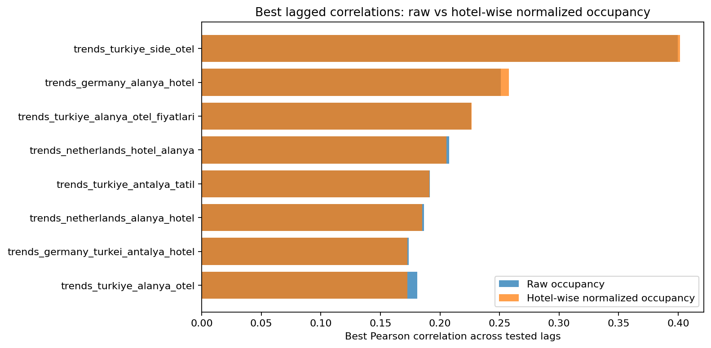
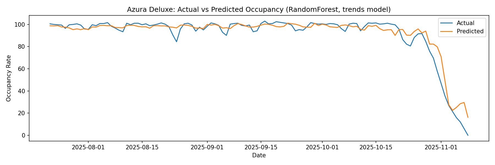
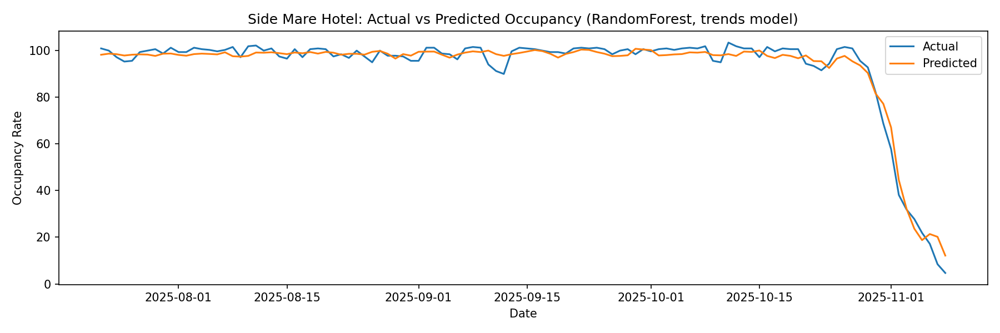
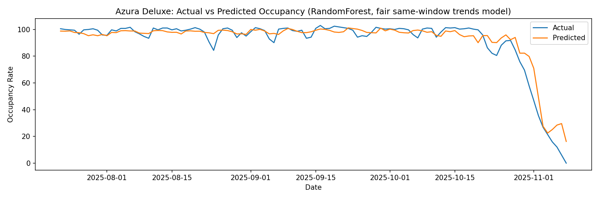
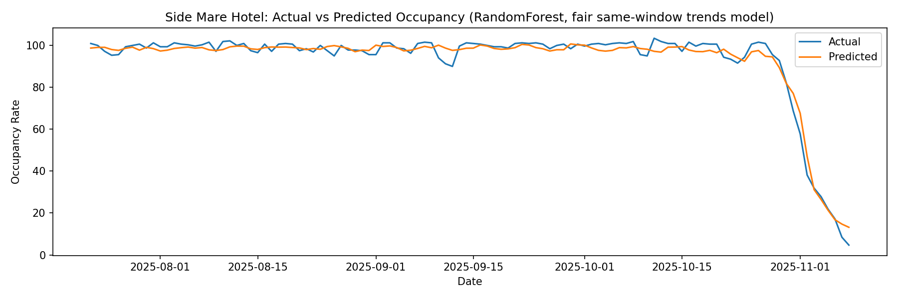
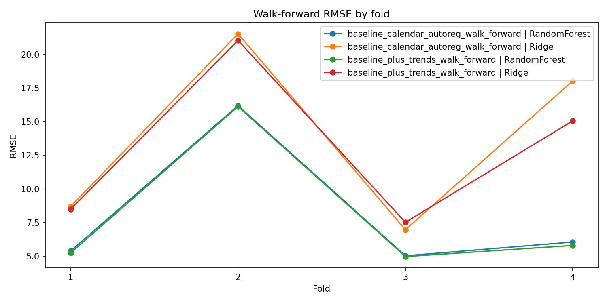
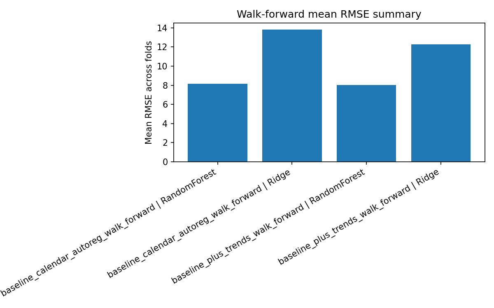
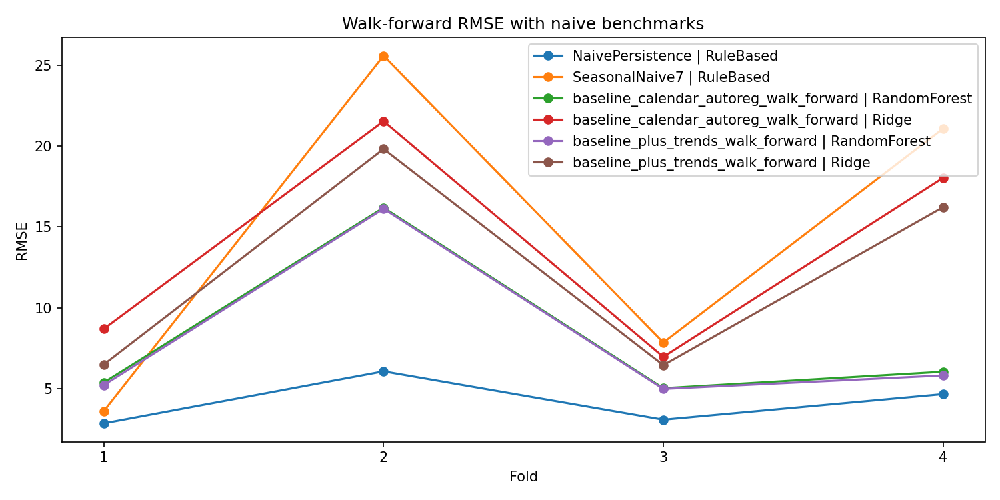
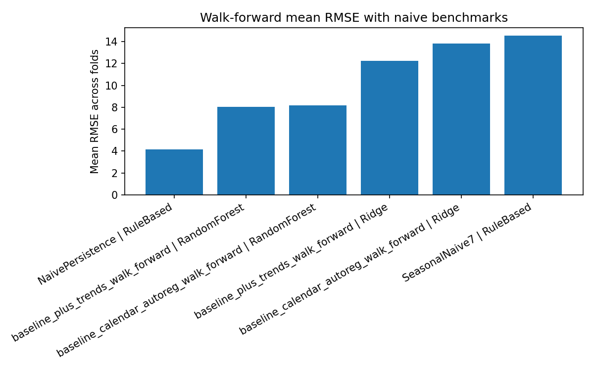

# Hotel Occupancy Prediction Using Google Trends

This repository contains an undergraduate data science project for **DSA210 - Introduction to Data Science**. The project investigates whether **Google Trends search interest** can help explain or predict **daily hotel occupancy rates** in the Antalya/Alanya region of Türkiye.

The main research question is:

> Can Google Trends act as an early signal for hotel occupancy demand in Antalya-area resort hotels?

The project uses daily occupancy data from two hotels and enriches it with Google Trends data collected from multiple source markets. The analysis includes exploratory data analysis, lagged correlation analysis, machine learning models, time-aware validation, robustness checks, and naive benchmark comparisons.

---

## Motivation

I grew up around hotels because my father works as a hotel manager. Seeing how many resources hotels need to allocate in advance made me interested in whether occupancy could be estimated earlier and more systematically. In hotel management, even a rough early signal can help with staffing, purchasing, planning, and operational preparation.

This led to the central question of the project: whether online search behavior, represented by Google Trends, can help explain or predict hotel occupancy rates.

Because resort hotels in Antalya and Alanya are not driven only by direct online searches, I did not expect Google Trends to be a perfect demand proxy. These hotels also rely heavily on tour operators, agencies, and other B2B channels. Therefore, the goal is not to claim that Google Trends fully explains occupancy, but to test whether it provides useful additional signal.

---

## Data Sources

### 1. Hotel Occupancy Data

Daily occupancy data was collected for two hotels:

- **Side Mare Hotel**
- **Azura Deluxe**

The data covers the **2023, 2024, and 2025 seasons**. The hotel data was requested directly from hotel management and purchasing contacts. These hotels do not represent all Antalya hotels, but they provide a meaningful starting point because both are located in the Antalya tourism region and operate in a similar resort-hotel context.

The standardized hotel dataset contains:

- `date`
- `hotel_name`
- `occupancy_rate`

### 2. Google Trends Data

Google Trends data was collected manually through the **Google Trends web interface** and exported as CSV files. Search interest was collected for four countries:

- Germany
- Netherlands
- United Kingdom
- Türkiye

For each country, multiple Antalya/tourism-related keywords were tested. The keywords with the most usable search-volume data were selected. These search trends were used as external demand-intent signals.

The cleaned Google Trends dataset contains:

- `date`
- `country`
- `keyword`
- `google_trend`

---

## Project Workflow

The project follows a full data science pipeline:

1. Data collection
2. Data cleaning and standardization
3. Exploratory data analysis
4. Google Trends lag analysis
5. Feature engineering
6. Baseline machine learning models
7. Fair same-window comparison
8. Walk-forward validation
9. Hotel-wise normalization robustness check
10. Naive benchmark comparison
11. Interpretation and conclusion

---

## Visual Overview

### Hotel-level occupancy seasonality

The EDA showed that hotel occupancy is strongly seasonal. This means that calendar effects and previous occupancy values are expected to be strong predictors.



This figure is useful because it shows that the project is not only modeling raw occupancy values, but also checking whether relationships remain meaningful after considering hotel-level differences.

---

### Baseline model predictions

The first ML stage used calendar features, lagged occupancy features, and Google Trends features to predict daily occupancy.





These plots compare the model predictions with actual occupancy values for each hotel. They help visually assess whether the model follows the general seasonal pattern and where it fails to capture sharper day-to-day movements.

---

### Fair same-window comparison

A fair same-window comparison was added because different feature sets can otherwise be evaluated on slightly different subsets of the data. This makes model comparisons less reliable. The same-window version ensures that the compared models are evaluated on the same rows.





---

### Walk-forward validation

Because the data is temporal, random splitting is not the most realistic evaluation method. Walk-forward validation was added to test whether the model performs reasonably when trained on earlier dates and evaluated on later dates.





This validation is important because it better reflects a real forecasting scenario than a random train-test split.

---

### Naive benchmark comparison

A naive persistence benchmark was added to test whether the learned models are truly useful compared with a simple rule-based forecast. The persistence benchmark predicts future occupancy using recent past occupancy.





The benchmark comparison is one of the most important parts of the project. It shows that although learned models can benefit from Google Trends and engineered features, simple persistence remains very competitive because occupancy is highly autocorrelated and seasonal.

---

## Machine Learning Methods

The ML part includes several modeling and evaluation stages:

### Baseline modeling

The baseline model uses:

- calendar features
- hotel identity
- past occupancy features
- Google Trends features
- lagged Google Trends features

The purpose was to test whether Trends features improve prediction beyond basic calendar and historical occupancy signals.

### Hotel-wise normalization robustness

A hotel-wise normalization robustness check was added because the two hotels can have different occupancy levels and distributions. This check tests whether the model behavior is only driven by hotel-level scale differences or whether the relationship is still meaningful after normalization.

### Fair same-window comparison

This comparison ensures that models with different feature availability are evaluated on the same rows. This avoids unfair comparisons caused by missing lagged features or different sample sizes.

### Walk-forward validation

Walk-forward validation was used because the project is based on time-ordered data. This avoids training on future information and gives a more realistic estimate of predictive performance.

### Naive benchmark comparison

Naive benchmarks were added to provide a practical reference point. In time-series-like hotel occupancy data, a model is only useful if it can outperform simple persistence-based predictions.

---

## Explicit Metric Improvement Summary

The final phase feedback emphasized that the repository should state **explicitly** whether Google Trends features improved predictive metrics. The answer is **yes inside the learned-model framework**.

### Learned-model comparisons: without Trends vs with Trends

| Comparison | Best baseline RMSE | Best baseline + Trends RMSE | RMSE improvement from Trends |
|---|---:|---:|---:|
| First-pass holdout | 5.87 | 4.80 | 1.07 |
| Fair same-window | 4.974 | 4.798 | 0.176 |
| Walk-forward mean | 8.166 | 8.035 | 0.131 |

These results show that **adding lagged Google Trends improved the learned models in every main learned-model comparison**.

### Final benchmark check

However, the final benchmark comparison changes the interpretation of those gains:

| Comparison | Best learned model RMSE | NaivePersistence RMSE |
|---|---:|---:|
| Fair same-window | 4.798 | 4.068 |
| Walk-forward mean | 8.035 | 4.170 |

So the final answer is more specific than a simple “yes”:
- **Yes:** Google Trends improved the learned models relative to the no-Trends learned baseline.
- **No:** The current learned models still did **not** beat the strongest simple benchmark, **NaivePersistence**.

---

## Key Findings

The main findings are:

- Hotel occupancy is strongly seasonal.
- Same-day Google Trends correlations are generally weak to moderate.
- Lagged Google Trends features are more promising than same-day Trends values.
- Some Türkiye and Germany search keywords appear more informative than many UK-based keywords.
- Calendar features and past occupancy remain the strongest predictors.
- Adding lagged Google Trends improved learned-model RMSE from **5.87 to 4.80** in the first-pass setup.
- Under the fair same-window comparison, adding lagged Google Trends improved RMSE from **4.974 to 4.798**.
- Under walk-forward validation, adding lagged Google Trends improved mean RMSE from **8.166 to 8.035**.
- However, **NaivePersistence** remained stronger than all learned models.
- Therefore, Google Trends should be interpreted as a **supporting signal** rather than a standalone or dominant predictor of hotel occupancy.

---

## Repository Structure

```text
myDSAproject/
│
├── Data/
│   └── Cleaned and standardized hotel / Google Trends datasets
│
├── EDA/
│   ├── EDA_detailed_report.ipynb
│   └── Visualizations/
│       └── EDA figures
│
├── ML/
│   ├── ML_detailed_report.ipynb
│   ├── FIGURE_REPRODUCIBILITY.md
│   └── Figures/
│       ├── Model result figures
│       └── Naive_Benchmark/
│           └── Naive benchmark comparison figures
│
├── reports/
│   ├── EDA_reports/
│   └── ML_reports/
│
├── scripts/
│   ├── run_ml_pipeline.py
│   ├── modeling_baseline_commented.py
│   ├── hotel_normalization_robustness_commented.py
│   ├── modeling_fair_comparison_commented.py
│   ├── modeling_walk_forward_commented.py
│   ├── modeling_naive_benchmarks_commented.py
│   └── sync_ml_report_figures.py
│
├── requirements.txt
└── README.md
```

---

## How to Reproduce the Analysis

### 1. Clone the repository

```bash
git clone https://github.com/bedirhansar-lang/myDSAproject.git
cd myDSAproject
```

### 2. Install requirements

```bash
python -m pip install -r requirements.txt
```

### 3. Run the ML pipeline

```bash
python scripts/run_ml_pipeline.py
```

This runs the ML scripts in the correct order and syncs the generated figures into the report folders.

### 4. Open the detailed reports

```bash
python -m notebook EDA/EDA_detailed_report.ipynb
python -m notebook ML/ML_detailed_report.ipynb
```

If `jupyter` is not recognized directly, use:

```bash
python -m notebook
```

---

## Final Conclusion

The final conclusion of the project is now explicit:

> Lagged Google Trends features **did improve the learned models’ metrics** relative to the no-Trends learned baseline in the first-pass, fair same-window, and walk-forward comparisons.
>
> However, the best learned models still **did not outperform NaivePersistence**, which means that daily occupancy forecasting in this dataset remains strongly dominated by short-run persistence.

So the most defensible interpretation is:
- Google Trends has **real but limited predictive value**,
- it works best as an **early supporting signal**,
- and it should be combined with seasonality and past occupancy rather than treated as the main driver of forecasts.

---

## Future Work

Possible future extensions include:

- Adding more hotels from different Antalya subregions
- Adding flight search or flight arrival data
- Adding weather, school holiday, and public holiday variables
- Testing additional time-series models
- Separating domestic and international demand more carefully
- Building hotel-specific models instead of only pooled models
- Testing longer forecast horizons

---

## Academic Integrity and AI Usage

AI tools were used in this project as support for planning, code commenting, debugging, repository organization, documentation writing, and methodological discussion. In particular, AI assistance was used to help structure the EDA-to-ML workflow, organize the repository folders, improve the README and notebook reports, detect issues in lagged Google Trends feature construction, and design additional analysis steps such as hotel-wise normalization robustness, fair same-window comparison, walk-forward validation, and naive benchmark comparison. AI was also used to help interpret model outputs more clearly and present the findings in an academically transparent way. Final decisions about the project design, implementation, result selection, and interpretation were made by the student.
